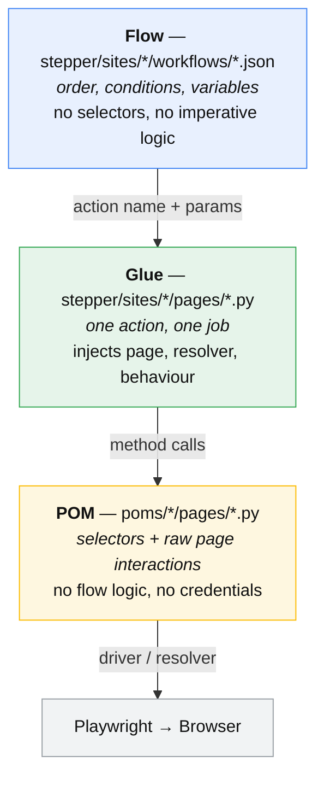
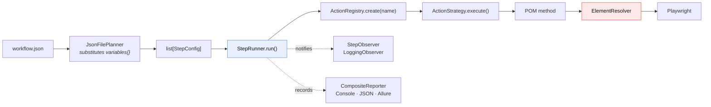
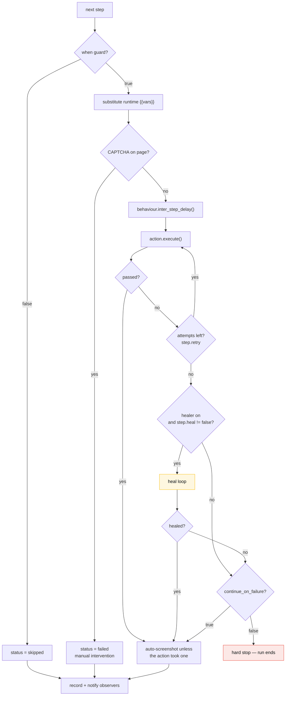
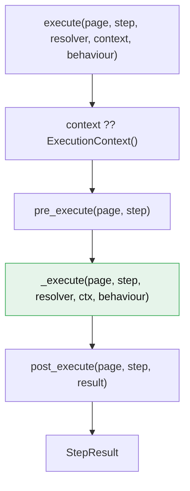
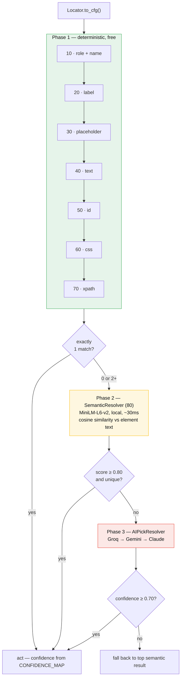
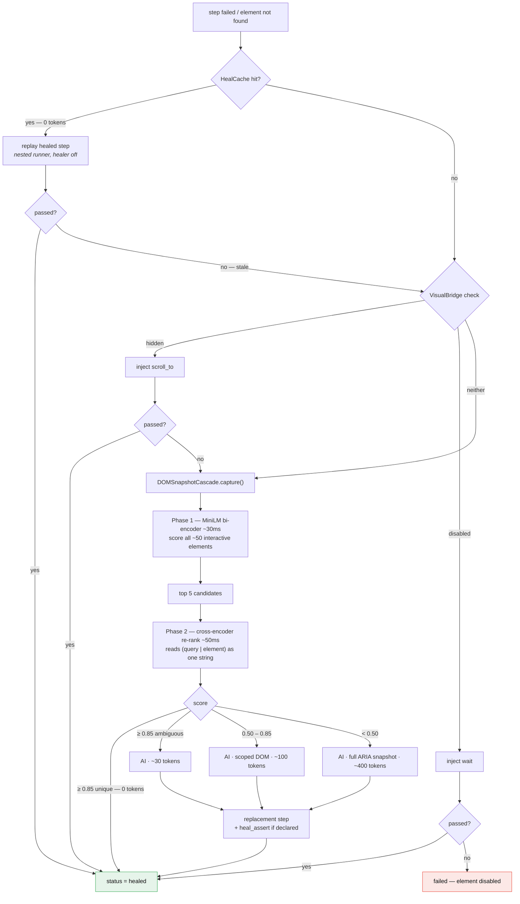
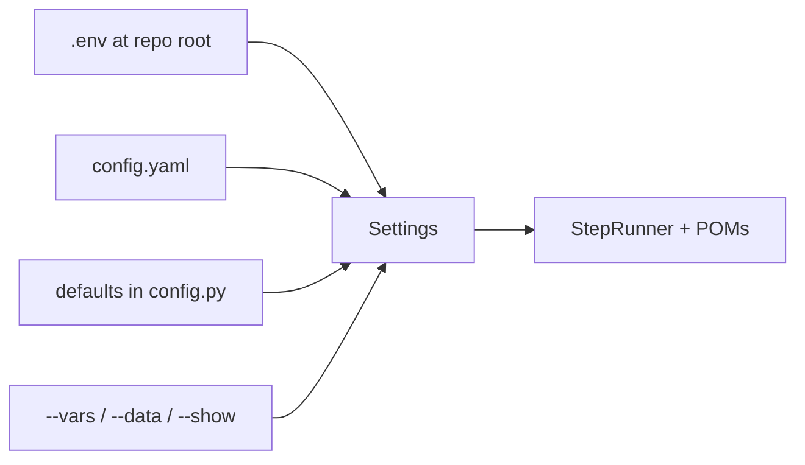
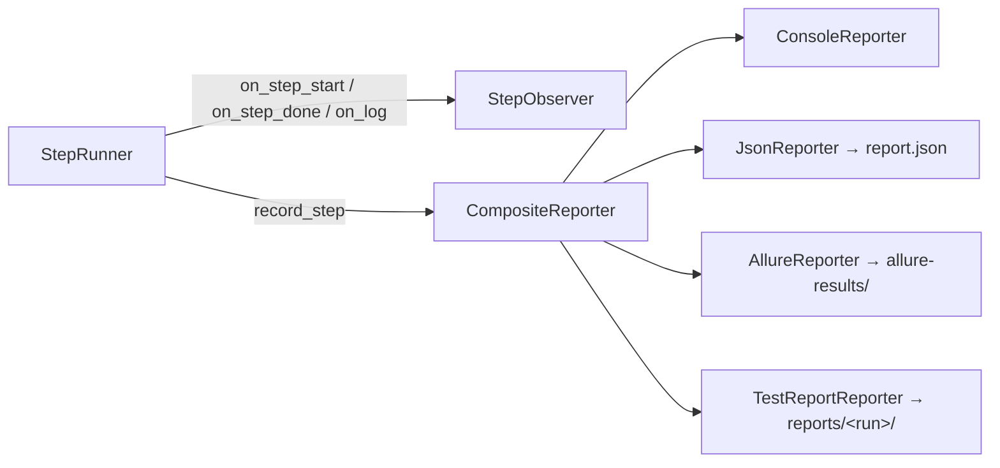

# Stepper Framework — Architecture

How a JSON step becomes a browser action, and what happens when it fails.

- [The three layers](#the-three-layers)
- [Repository map](#repository-map)
- [Running a workflow, end to end](#running-a-workflow-end-to-end)
- [One step's lifecycle](#one-steps-lifecycle)
- [Action execution — the template method](#action-execution--the-template-method)
- [Element resolution cascade](#element-resolution-cascade)
- [Self-healing cascade](#self-healing-cascade)
- [Configuration](#configuration)
- [Reporting](#reporting)
- [Extension points](#extension-points)

---

## The three layers

The central constraint: **a CSS selector may exist in exactly one place — a `Locator`
inside a POM.** Neither the JSON above nor the engine beside it may name an element.



**Dependency direction is one-way: Flow → Glue → POM.** `poms/` imports nothing from
`stepper/`, which is what lets the POM layer run with no engine at all — see
[`examples/plain_pom/`](examples/plain_pom/).

Rules: [three-layer-contract.md](.claude/rules/three-layer-contract.md) ·
[pom-layer.md](.claude/rules/pom-layer.md) ·
[glue-layer.md](.claude/rules/glue-layer.md)

---

## Repository map

```
poms/                          POM layer — no dependency on stepper/
├── shared/
│   ├── base_page.py           BasePage — _interact() dispatches resolver vs driver
│   ├── locator.py             Locator value object — to_cfg() / css_candidates()
│   ├── driver.py              PlaywrightDriver — the Adapter over Playwright's Page
│   ├── interfaces.py          IBrowserDriver, IElementHandle
│   ├── constants.py           CONFIDENCE_AUTO / CONFIDENCE_WARN
│   └── performance.py         Navigation-timing capture
├── openLibrary/ saucedemo/ phpTravels/
│   ├── config.py              load_settings() — YAML + env
│   ├── data/testdata.json     Data-driven cases
│   └── pages/                 One class per page; selectors live here and nowhere else

stepper/
├── main.py                    CLI entry — builds the registry, runner and reporters
├── bootstrap/                 .env loading, infra and reporter wiring
├── engine/
│   ├── interfaces.py          ActionStrategy, ResolverStrategy, ReporterStrategy,
│   │                          StepConfig, StepResult, ExecutionContext
│   ├── actions/
│   │   ├── factory.py         ActionRegistry + build_default_registry()
│   │   ├── strategies.py      The 23 engine actions
│   │   └── sub_step_mixin.py  Nested-step dispatch for for_each_item / ensure_login
│   ├── resolvers/             The cascade — strategies.py, element_resolver.py,
│   │                          ai_pick_resolver.py, shadow_runner.py
│   ├── healer/                dom_snapshot.py, ai_healer.py, healing_cache.py,
│   │                          visual_bridge.py, annotator.py
│   ├── runner/                step_runner.py, when_eval.py
│   ├── planner/               JSON + AI planners, schema extraction, validation
│   ├── reporter/              Console, JSON, Allure, Composite
│   ├── pages/                 PageModule ABC + GlueAction base
│   ├── ai/                    Provider chain (Groq → Gemini → Claude)
│   └── browser/               human_behaviour.py, anti_detection.py
├── sites/<site>/
│   ├── pages/                 Glue — wraps POMs into named actions
│   ├── workflows/*.json       Declarative flows
│   └── register.py            Wires the site's PageModules into the registry
├── models/all-MiniLM-L6-v2/   Local embedding model (Phase 2)
└── tests/unit/                Fast, mocked, no browser

examples/plain_pom/            POMs driven with no engine and no resolver
docs/playwright-pitfalls.md    Failure modes the POM layer guards against
```

---

## Running a workflow, end to end



`variables{}` are substituted at **plan time** by the planner. Values written into
`ExecutionContext` by earlier steps are substituted at **runtime** by `StepRunner`, which
is why `"limit": "{{gap}}"` resolves to whatever the previous step stored.

---

## One step's lifecycle

This is the loop that actually runs. Retry, healing and `continue_on_failure` live
here — **not** inside the actions.



Step-level controls — `when`, `retry`, `retry_delay_ms`, `continue_on_failure`, `heal`,
`heal_assert`, `skip_screenshot` — are documented with their defaults in the
[README](README.md#step-controls). Flow-level defaults pass down to every step; a step
always wins over the flow.

---

## Action execution — the template method

`ActionStrategy.execute()` is the **only** path into an action. Engine actions and glue
actions share it; neither may override it.



`_execute` is the subclass's slot and takes five parameters, with `behaviour` defaulting
to `None` — nested dispatch (`for_each_item`, `ensure_login`, `parallel`, `paginate`) may
not have one to pass.

Overriding `execute()` silently disables the hooks and context defaulting. That bug
shipped once already; `stepper/tests/unit/test_action_template_method.py` now fails if it
returns.

`GlueAction` adds two helpers on top:

| Helper | Guarantee |
|---|---|
| `_build_pom(cls, …, page=, resolver=, behaviour=)` | All three keyword-mandatory — a forgotten resolver is a `TypeError`, not a silently degraded run |
| `_driver(page)` | Wraps the page in `PlaywrightDriver`, imported lazily so glue has no top-level `poms` import |

**`StepResult` fields**

| Field | Meaning |
|---|---|
| `status` | `passed` · `failed` · `skipped` · `warned` · `healed` |
| `error` / `skip_reason` | Populated by failure / by a false `when` guard |
| `confidence` | Resolver confidence for the element that was acted on |
| `duration_ms` | Wall time including retries |
| `screenshot` / `screenshots` | Path, or all paths from multi-shot actions |
| `output` | Step-produced data, persisted to `results.json` |
| `heal_attempts` | `0` when no healing was needed |
| `healed_element` | `{original, healed}` cfg pair |

Action catalogues live in one place each: engine actions in the
[README](README.md#engine-actions), site actions in
[site-actions.md](.claude/rules/site-actions.md).

---

## Element resolution cascade

Strategies are tried in ascending `priority`. Phase 1 is free and deterministic; Phase 2
is local and costs ~30ms; Phase 3 costs money. The cascade stops at the first
**unique** match.



Priority order mirrors Playwright's own locator guidance, and the confidence assigned to
a hit reflects how well that strategy survives a redesign:

| Strategy | Priority | Confidence | Why there |
|---|---|---|---|
| `role` + `name` | 10 | 0.95 | Accessible name — survives restyling and DOM moves |
| `label` | 20 | 0.93 | Associated `<label>`, semantically stable |
| `placeholder` | 30 | 0.90 | Visible input hint |
| `text` | 40 | 0.85 | Can match non-interactive elements |
| `id` | 50 | 0.82 | Unique, but fragile when ids are generated |
| `css` | 60 | 0.75 | Implementation detail — breaks on class refactors |
| `xpath` | 70 | 0.70 | Encodes the DOM shape; breaks first |
| semantic | 80 | actual score | Phase 2 |
| visual-AI | 90 | model score | Last resort |

Below `CONFIDENCE_WARN` (0.50) `_interact` refuses to act; between 0.50 and
`CONFIDENCE_AUTO` (0.80) it acts and logs a warning.

**Zero-selector mode:** a cfg with no recognised element key falls through to keyword-fuzzy
→ accessibility-semantic → AI pick, driven purely by the step's description.

Full rules: [resolver-cascade.md](.claude/rules/resolver-cascade.md)

---

## Self-healing cascade

Healing runs only after retries are exhausted. Every stage before the AI is free.



A successful heal writes back to `HealCache`, so the next run takes the zero-token path.
Suggestions are also written to `reports/<run>/heal_suggestions.json`, which
`--apply-heals` folds back into the workflow JSON after a diff.

Opt a step out with `"heal": false`. Verify a heal actually landed with
`"heal_assert": {"url_contains": "/inventory"}`.

---

## Configuration



Precedence, lowest to highest: dataclass defaults → YAML → environment → CLI flags.
Each site exposes `load_settings()`; credentials and API keys come from the environment
and never from code. `.env` belongs at the repo root — both the engine and the examples
look there first.

---

## Reporting

`StepRunner` knows nothing about output formats. It notifies observers and hands each
`StepResult` to a reporter.



| Artifact | Location |
|---|---|
| Allure results | `reports/allure-results/` |
| JSON report | `report.json` |
| Per-run folder | `reports/<timestamp>_<name>/` |
| Step results | `reports/<run>/results.json` |
| Heal suggestions | `reports/<run>/heal_suggestions.json` |
| Screenshots | `reports/<run>/screenshots/` |
| Run log | `reports/<run>/logs/run.log` |
| Performance data | `artifacts/performance.json` |

Adding a format means implementing `ReporterStrategy` and adding it to the composite —
no engine change.

---

## Extension points

| I want to… | Do this | Touches existing code? |
|---|---|---|
| Add a site | New `poms/<site>/` + `stepper/sites/<site>/`, then `register.py` | No |
| Add an engine action | Subclass `ActionStrategy`, register in `build_default_registry()` | One line |
| Add a site action | Subclass `GlueAction` inside a `PageModule`, register it | No |
| Add a resolver strategy | Implement `ResolverStrategy`, give it a priority, add to the chain | One line |
| Add a report format | Implement `ReporterStrategy`, add to the composite | One line |
| Add a planner | Implement `Planner`, inject at `StepRunner` construction | No |
| Swap the browser adapter | Implement `IBrowserDriver` | No |

The patterns behind these seams — Strategy, Template Method, Factory + Registry,
Observer, Chain of Responsibility, Adapter, Value Object, Mixin, Dependency Inversion —
are catalogued with their locations in
[design-patterns.md](.claude/rules/design-patterns.md).

For the engine's internal responsibility map, see
[stepper/engine/ARCHITECTURE.md](stepper/engine/ARCHITECTURE.md).
