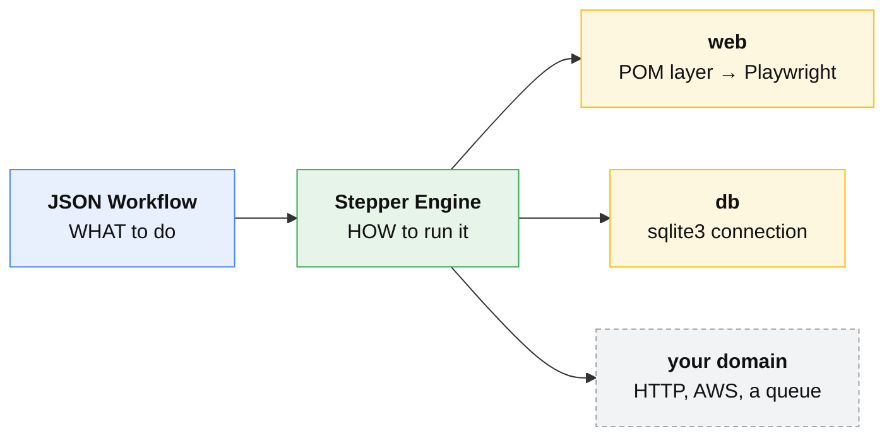
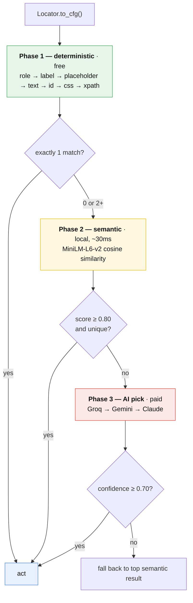
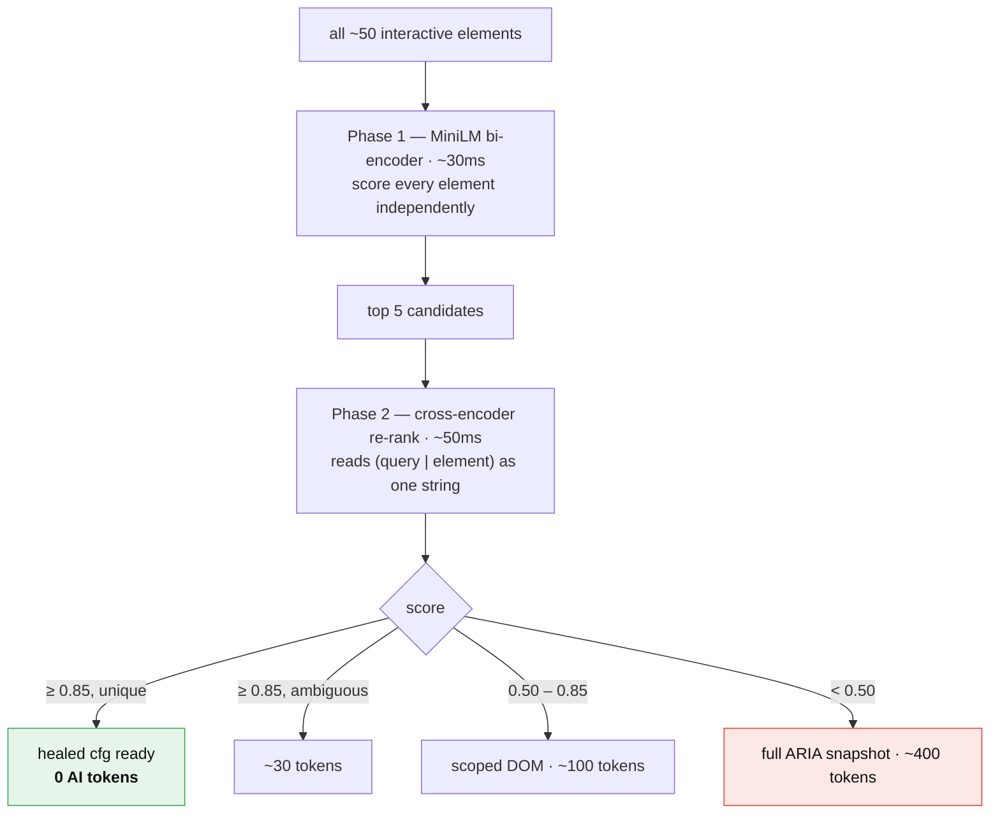

# Stepper Framework

A JSON-driven automation engine in Python, built on Playwright but no longer bound to it.

Workflows are declarative: a JSON file names *what* to do, the engine decides *how* to run
it — retries, conditional branching, context passing, parallelism and reporting — and a
three-layer architecture keeps every CSS selector in the page-object layer, out of both the
engine and the JSON.

Each action declares the **domain** it acts on, and the engine hands it that domain's
session. For the browser sites that is a Playwright `Page` — launched, or attached to a
running Electron app over CDP; for the `db` domain it is a `sqlite3.Connection`. One
workflow can use both: a step can read a value off a rendered page and a later step can
assert it through SQL, sharing one context and one report.

When a selector breaks, the resolver cascade and the self-healing pipeline try to find the
element anyway, escalating from free local strategies to paid AI only when they have to.

And a step that did not do its job says so. That sounds like table stakes; it is the thing
most of this codebase's own bugs turned out to be — see
**[a green step means it happened](#a-green-step-means-it-happened)**.



The engine holds no browser. Per step it asks the action which **domain** it acts
on and hands it that domain's session — a Playwright `Page`, a `sqlite3`
connection, whatever a domain you add opens. Sessions open on first use, so a
workflow with no browser steps never launches one.

---

## Quick Start

```bash
# 1. Install
pip install -r requirements.txt
playwright install chromium

#    Optional: pre-cache the ML models used by the semantic resolver and the
#    healer. Both fall back to downloading on first use, so this is only needed
#    to warm the cache ahead of time or to run offline.
python stepper/download_models.py

# 2. Verify the install — no browser, no network, no credentials
pytest stepper/tests/unit/

# 3. See what there is to run
python stepper/main.py list

# 4. Run something now. No account, no API key, nothing to sign up for:
#    the page is a checked-in fixture served on loopback.
python stepper/sites/ti/fixtures/server.py --port 8099 &
TI_BASE_URL=http://127.0.0.1:8099 python stepper/main.py run log_in_and_view_the_secure_area

# 5. Only when you want the live demo sites — .env belongs at the repo root,
#    where both the engine and the examples look for it first
cp stepper/.env.example .env
#    Fill in OPENLIBRARY_USERNAME / OPENLIBRARY_PASSWORD, plus at least one of
#    GROQ_API_KEY / GEMINI_API_KEY / ANTHROPIC_API_KEY if you want AI resolution.
python stepper/main.py run sd_happy_path
```

**12 of the 30 workflows run with no network and no credentials** — every
the-internet flow, the phpTravels booking flow, both database workflows and the
no-browser one. They are what CI runs on every push, and what to reach for when
you want to see the engine work before deciding whether to wire up your own app.
See [Running without a network](#running-without-a-network).

The sites here are demos. To drive your own app, see
**[docs/adding-your-app.md](docs/adding-your-app.md)** — six files, no edits to
anything that already exists.

### Commands

| Command | What it does |
|---|---|
| `run WORKFLOW` | Run a workflow, or `--task` to plan one from natural language |
| `list` | Every workflow on disk, grouped by site, with step counts |
| `actions` | Every registered action and what it does |
| `validate` | Check workflows without launching a browser — exits 1 if any is invalid |
| `heal apply WORKFLOW` | Review and apply the healer's selector fixes |

`python stepper/main.py <command> --help` explains one command's options.

Useful `run` flags: `--show` (headed browser), `--video`, `--allure-serve`, `--ci`,
`--vars '{"query":"Dune"}'`, `--data <testdata.json>`, `--heal N`,
`--no-heal-cache` (resolve every heal through the cascade instead of replaying
`heal_cache.json` — what you want when measuring what the healer can actually do).

Workflows are referred to by name — `sd_happy_path` resolves across all sites, and
full paths still work anywhere a name is accepted. The older flag-only form
(`--workflow <path>`) also still works, with a one-line note pointing at the new
spelling.

---

## Three-Layer Architecture

```
  Layer         Location                      Responsibility
  ────────────  ────────────────────────────  ──────────────────────────────────────────
  Flow (JSON)   stepper/sites/*/workflows/    Order, conditions, variables.
                                              No selectors. No imperative logic.

  Glue          stepper/sites/*/pages/        Wraps a POM into a named Stepper action.
                                              One action, one job.
                                              Injects page=, resolver=, behaviour=.

  POM           poms/*/pages/                 Selectors + raw page interactions only.
                                              No flow logic. No credentials.
                                              Interactive locators are Locator objects.
```

**Dependency direction is one-way: Flow → Glue → POM. Never reversed.**

Every element identifier lives in a `Locator` value object inside a POM's `Locators` inner
class. Workflow JSON contains action names and parameters only — never a CSS selector.

Full diagrams: [ARCHITECTURE.md](ARCHITECTURE.md).
Where things stand: [docs/state-of-the-stepper.md](docs/state-of-the-stepper.md).
Layer rules: [.claude/rules/three-layer-contract.md](.claude/rules/three-layer-contract.md).

---

## Domains — one run, several kinds of step

The three layers say *where code lives*. A **domain** says *what a step acts on*,
and it is the axis that makes this more than a Playwright wrapper.

```
  ┌────────────────────────────────────────────────────────────┐
  │  StepRunner — steps, results, retry, healing, observers    │
  │  knows nothing about browsers, pages or selectors          │
  └──────────────────────────┬─────────────────────────────────┘
                             │ per step: which domain?
        ┌────────────────────┼────────────────────┐
        ▼                    ▼                    ▼
   ┌─────────┐         ┌───────────┐        ┌──────────┐
   │   web   │         │    db     │        │   noop   │
   │  Page   │         │Connection │        │  object  │
   └─────────┘         └───────────┘        └──────────┘
```

### One workflow, two domains

This is the whole point, so here it is as a file rather than a claim. A browser
step reads a value off a rendered page, a database step writes it, and a later
browser step is gated on what the database says — one `ExecutionContext`, one
report, two sessions open at once:

```json
{
  "domain": "web",
  "steps": [
    { "action": "navigate", "description": "web: open the page",
      "url": "{{page_url}}" },

    { "action": "store", "description": "web: read the count off the page",
      "element": { "id": "item-count" }, "extra": { "key": "on_hand" } },

    { "action": "db_execute", "description": "db: write what the browser read",
      "extra": { "sql": "INSERT INTO stock_takes (item, on_hand) VALUES (?, ?)",
                 "params": ["Dune", "{{on_hand}}"] } },

    { "action": "click", "description": "web: confirm, once the database agrees",
      "element": { "role": "button", "name": "Confirm stock take" },
      "when": { "db_row_exists": {
                  "sql": "SELECT 1 FROM stock_takes WHERE item = ?",
                  "params": ["Dune"] } } }
  ]
}
```

`{{on_hand}}` is resolved from the run's context, and SQL values are bound as
parameters rather than pasted into the statement. `db_row_exists` is the db
domain's own `when` condition — a run's condition vocabulary is the merge of
every domain it uses.

That workflow ships as `db_web_mixed.json` and runs in CI against a real
browser with **no network and no credentials**: the page is a checked-in
`file://` fixture and the database is a temp file.

### The same domain, a different session

A domain's session is not one fixed thing. The **web** domain launches a
browser by default, or attaches over CDP to an Electron desktop app that is
already running:

```bash
STEPPER_ELECTRON_CDP_PORT=9222 python stepper/main.py run <workflow>
```

Electron renders a DOM, so every web action, every POM and the whole resolver
cascade apply unchanged — only where the `Page` comes from differs. Teardown
does not: a launched browser is closed, an app we merely attached to is
disconnected from and left running.

### What a domain supplies

```
  session     what to open, and how to close it        (required)
  hooks       what runs around each of its steps
  shared      a handle several runs may reuse
  conditions  its own `when` vocabulary, domain-tagged
  preflight   what is missing here, checked before anything opens
```

A domain declares itself from its own folder under `stepper/sites/`;
`register_all_sites` globs `sites/*/register.py`, so **no central file lists
them** and adding one edits nothing outside its own directory.

`validate` reports the domains each workflow needs before opening anything:

```
  OK    sd_happy_path     6 steps  [web]
  OK    db_smoke          6 steps  [db]
  OK    db_web_mixed      8 steps  [db, web]
  OK ?  sd_smoke_test     5 steps  [web]     ← valid, but no browser here
```

`OK ?` means the workflow is well-formed but a domain it needs is not ready on
this machine. `validate` reports that and still exits 0; `run` refuses.

The POM layer stays browser-only. A non-browser domain has no selectors, so it
has no POMs and its actions subclass `ActionStrategy` directly rather than
`GlueAction` — there is nothing to inject a resolver into.

How this came about: [docs/universal-runner-plan.md](docs/universal-runner-plan.md) ·
[docs/mixed-domain-plan.md](docs/mixed-domain-plan.md).

---

## Smart Locators — Resolver Cascade

`ElementResolver` tries strategies in resilience order and stops at the first confident
match, escalating only when cheaper phases are ambiguous:



Priority order mirrors Playwright's own locator guidance: `role` survives redesigns,
`xpath` encodes the whole DOM shape and breaks first. Details and the confidence
constants: [.claude/rules/resolver-cascade.md](.claude/rules/resolver-cascade.md).

The cascade is optional. A POM built with `resolver=None` falls back to its `Locator`'s
CSS candidates and works with no AI, no keys and no network — see
[`examples/plain_pom/`](examples/plain_pom/).

---

## Self-Healing — DOM Snapshot Cascade

When a step fails, `DOMSnapshotCascade` scores every interactive element on the page
before spending a single AI token:



**The top rung needs no API key.** A unique match above 0.85 is healed from the
element's own attributes — no provider is called, so `--heal` is useful on a stock
install with an empty `.env`. Keys buy the lower rungs, not the feature. Without
them the AI rungs fail per-step and the run reports those heals as failed;
anything the embeddings resolve is still healed for nothing.

Opt a step out with `"heal": false`. Verify a heal landed with `"heal_assert"` —
and note that `heal_assert` is checked on the cached path as well as the cascade,
so a stale `heal_cache.json` entry cannot report a heal it did not achieve.

Apply cached heal suggestions back into the workflow JSON after a run:

```bash
python stepper/main.py heal apply sd_full_heal_flow
```

It finds the most recent `heal_suggestions.json` under `reports/`, shows a per-step
before/after diff, and patches the JSON in place (`--yes` to skip confirmation).

`sd_heal_test.json` and `sd_full_heal_flow.json` ship with deliberately broken selectors.
Run them with `--heal 2 --no-heal-cache` to watch the cascade recover each one — the
embed-direct rung needs no API key.

They are **not** yet part of CI, and the honest reason is worth knowing: an
`assert_*` step resolves through the full cascade, fuzzy fallbacks included, so an
assertion can pass by matching a *different* element than the one it names. Until
assertions resolve strictly, a green heal workflow would not prove the heal worked.
Until then this is a claim about what the healer does, not a guarantee CI enforces.

---

## Step Controls

| Field | Default | Effect |
|---|---|---|
| `when` | — | Skip the step if the condition is false |
| `retry` | `0` | Retry on failure up to N times |
| `retry_delay_ms` | `1000` | Milliseconds between retries |
| `continue_on_failure` | `false` | `true` → warn and continue; `false` → hard-stop |
| `heal` | `true` | `false` → opt this step out of the healing loop |
| `heal_assert` | — | Post-heal assertion, e.g. `{"url_contains": "/inventory"}` |
| `skip_screenshot` | `false` | Suppress the automatic post-step screenshot |
| `extra` | — | Arbitrary action config; supports `{{var}}` substitution |

Retry, `continue_on_failure` and healing are handled by `StepRunner`, not by the actions
themselves — an action's job is one attempt at one thing.

### `when` conditions

| Condition | Syntax |
|---|---|
| `context_equals` | `{ "key": "k", "value": 0 }` |
| `context_key_exists` | `"key_name"` |
| `context_greater_than` | `{ "key": "gap", "value": 0 }` |
| `context_less_than` | `{ "key": "count", "value": 10 }` |
| `context_between` | `{ "key": "count", "min": 2, "max": 8 }` |
| `url_contains` | `"/account/login"` |
| `element_exists` | `"input[name='q']"` |
| `not` / `all` / `any` | invert / AND / OR |

### Flow-level defaults

Declared once at the top; every step inherits unless it overrides. Step always wins:

```json
{
  "continue_on_failure": true,
  "steps": [
    { "action": "ol_ensure_login", "continue_on_failure": false },
    { "action": "screenshot" }
  ]
}
```

### Variables

`variables{}` are substituted at **plan time**, from the workflow's own block. Anything an
earlier step stored is substituted at **runtime**, from the `ExecutionContext` — so
`{{gap}}` resolves to the count a previous step wrote, and `{{item}}` to a value `store`
captured off the page:

```json
{ "action": "ol_collect_books",
  "when":  { "context_greater_than": { "key": "gap", "value": 0 } },
  "extra": { "limit": "{{gap}}" } }
```

A pure `"{{key}}"` reference preserves its type (int, bool); mixed strings like
`"page_{{n}}"` are string-substituted. Runtime substitution reaches `url`, `input_value`,
`element`, `extra`, `when` and `description`, and **fails the step** when the context has
no such name — unlike plan-time substitution, which leaves an unknown token alone. The
difference is where the output goes: a stray token in a log line is a nuisance, one in an
action's arguments is not.

Override any variable without touching the JSON:

```bash
python stepper/main.py run ol_regression_roundtrip \
  --vars '{"query":"Asimov","max_year":1960,"limit":2}'
```

---

## Engine Actions

Registered in `build_default_registry()` and available to every *site* — which
is not the same as every *domain*. All but two act on the **web** domain and
receive a Playwright `Page`; `load_test_data` and `run_workflow` declare no
domain and are handed no session at all.

| Action | Description |
|---|---|
| `navigate` | Go to a URL |
| `click` | Click an element via the resolver cascade |
| `fill` | Type into an input |
| `hover` | Hover (triggers CSS `:hover` menus) |
| `select` | Choose from a `<select>` by label, index or value |
| `keyboard_press` | Press a key or chord |
| `scroll_to` | Scroll an element into view |
| `wait` | Wait for a selector, URL fragment or fixed seconds |
| `screenshot` | Capture a screenshot to file |
| `store` | Write an arbitrary value into the execution context |
| `store_count` | Count elements via CSS selectors, store in context |
| `assert_count` | Assert element count matches expected |
| `assert_text` | Assert an element's text |
| `assert_visible` | Assert an element is visible |
| `extract_data` | Scrape DOM data into `context.extracted_data` |
| `paginate` | Loop pages, accumulate into `context.paginated_data` |
| `for_each_item` | Loop `context.collected_items`, run sub-steps per item |
| `ensure_login` | Generic login subflow — takes a `login_steps` list |
| `run_workflow` | Run a sub-workflow JSON, then return to the parent flow |
| `parallel` | Run `read_only` sub-steps concurrently in separate tabs |
| `measure_performance` | Collect `first_paint_ms`, `dom_content_loaded_ms`, `load_time_ms` |
| `visual_compare` | Pixel diff against a stored baseline |
| `load_test_data` | Load a JSON test-data file into `context.test_data` |

Site-specific actions (`ol_*`, `sd_*`, `pt_*`) are catalogued in
[.claude/rules/site-actions.md](.claude/rules/site-actions.md).

### Actions from a non-browser domain

Registered by `stepper/sites/db/register.py`, not by the engine — a domain
brings its own actions the same way a site does. `page` here is the
`sqlite3.Connection` the db domain opened:

| Action | Description |
|---|---|
| `db_execute` | Run a statement that changes the database, and commit it |
| `db_query` | Read the first column of the first row into the context |
| `db_assert_count` | Count rows and compare against `extra.expected` |

SQL values come from `extra.params` and are **bound, never interpolated** — a
`{{name}}` inside a param reads a value an earlier step stored, and an
unresolved one fails the step rather than being written as a literal.

The db domain also registers one `when` condition, `db_row_exists`. Full tables
for every site and domain: [.claude/rules/site-actions.md](.claude/rules/site-actions.md).

---

## Workflows

Thirty ready-to-run workflows — `python stepper/main.py list` prints this table
live from disk, and `python stepper/main.py validate` adds the domains each one
opens. The ones marked **hermetic** need no network and no credentials. Run any of them from the repo root:

```bash
python stepper/main.py run <workflow-name>
```

**OpenLibrary** — `stepper/sites/openlibrary/workflows/`

| Workflow | What it showcases |
|---|---|
| `ol_search_and_add.json` | Main flow: clear → search → add → assert |
| `ol_add_only.json` | Idempotent append — no clear step |
| `ol_ensure_count.json` | Top-up to target N via `when` + `{{gap}}` |
| `ol_regression_roundtrip.json` | Full lifecycle + delta and absolute asserts |
| `ol_multi_author.json` | Two-query sequential composition |
| `ol_parallel_perf.json` | Three pages benchmarked concurrently |
| `ol_smoke_test.json` | `when`-guarded + `continue_on_failure` soft-fail |
| `ol_idempotency_test.json` | Add the same books twice → count must not grow |
| `ol_data_driven.json` | Data-driven runs via `--data testdata.json` |
| `login.json` | Reusable login subflow |

**SauceDemo** — `stepper/sites/saucedemo/workflows/`

| Workflow | What it showcases |
|---|---|
| `sd_happy_path.json` | Login → add to cart → checkout |
| `sd_multi_product.json` | Add multiple products, verify cart |
| `sd_smoke_test.json` | Smoke check with `continue_on_failure` |
| `sd_heal_test.json` | Self-healing under a changed selector |
| `sd_full_heal_flow.json` | Full heal demo — broken selectors throughout |

**phpTravels** — `stepper/sites/phptravels/workflows/` · *hermetic against fixtures*

| Workflow | What it showcases |
|---|---|
| `hotel_booking.json` | Login → typeahead search → select → book, with a confirmation read back |

**the-internet** — `stepper/sites/ti/workflows/` · *hermetic against fixtures*

The interactions the other sites do not exercise. Generated from a crawl by
`/discover-site` + `/generate-poms`, then run — which is how two real bugs in them
surfaced.

| Workflow | What it showcases |
|---|---|
| `log_in_and_view_the_secure_area.json` | Form POST, session cookie, redirect, flash message |
| `log_out_from_secure_area.json` | The same in reverse, confirming the flash |
| `check_and_uncheck_checkboxes.json` | Inputs whose label text is a sibling node, not a `<label>` |
| `select_an_option_from_the_dropdown.json` | A native `<select>`, driven by `select_option` rather than the cascade |
| `trigger_and_dismiss_javascript_alerts.json` | All three native dialogs — alert, confirm, prompt |
| `hover_over_elements_to_reveal_hidden_text.json` | A link that is in the DOM but unclickable until hovered |
| `open_a_new_window_and_switch_to_it.json` | `target="_blank"` and switching to the new page |
| `drag_and_drop_columns.json` | HTML5 drag-and-drop, with an observable result |

**Pathly Studio** — `stepper/sites/pathly/workflows/` · *needs the app running*

An Electron app, reached over CDP. Still the `web` domain — same actions, same POMs,
same cascade; only where the `Page` comes from differs. Nothing here launches the app,
and `run` refuses at plan time if nothing is listening.

| Workflow | What it showcases |
|---|---|
| `pathly_smoke.json` | Attach, open a project, walk the main panels |
| `pathly_settings.json` | Read the routing engine into the context — read-only |
| `pathly_wizard_smoke.json` | The flow wizard end to end |

**db** — `stepper/sites/db/workflows/` · *hermetic, no browser required*

| Workflow | What it showcases |
|---|---|
| `db_smoke.json` | SQLite only — seed, read back, assert, gate a step on `db_row_exists` |
| `db_web_mixed.json` | **A browser session and a database connection in one run**, sharing a context and a report. Hermetic: a `file://` fixture page and a temp database |

**noop** — `stepper/sites/_noop/workflows/` · *hermetic, not a real site*

| Workflow | What it showcases |
|---|---|
| `noop_smoke.json` | The engine running with no browser, no resolver and no POMs — its test asserts Playwright never reaches `sys.modules` |

The two below need an argument, since one takes a path and the other a database:

```bash
python stepper/main.py run db_smoke

python stepper/main.py run db_web_mixed \
  --vars "{\"page_url\": \"file://$PWD/stepper/sites/db/fixtures/inventory.html\"}"
```

---

## Examples

[`examples/plain_pom/`](examples/plain_pom/) drives the same OpenLibrary page objects
directly from pytest — no engine, no resolver, no AI. It is the counterpart to
`ol_search_and_add.json`: the same flow written imperatively.

```bash
cd examples/plain_pom && pytest tests/ -v
```

It exists to keep the POM layer honest. POMs there are constructed without `page=` or
`resolver=`, so if anything in the POM layer ever starts depending on the engine, this
suite breaks first.

The trade-off it demonstrates:

| Capability | Plain POM | Stepper workflow |
|---|---|---|
| Data-driven cases | `testdata.json` + `pytest_generate_tests` | `variables{}` in JSON |
| State between steps | a Python dict passed around | `{{gap}}` resolved at runtime |
| Conditional execution | `if` in the test body | declarative `when:` guard |
| Retry | manual `try/except` | `retry` / `retry_delay_ms` per step |
| Composition | copy-paste or a helper | `run_workflow` action |
| Parallelism | asyncio boilerplate in the test | `parallel` action |
| Screenshots / reports | manual calls | observer fires after every step |
| Broken selector | test fails | resolver cascade, then healer |

---

## A green step means it happened

The most useful property this framework has is not the resolver or the healer. It is
that a step which did not do its job says so.

That is harder than it sounds, because of one design decision. `_interact()` is the
single path every click and fill takes, and **it never raises**. A missing selector, a
resolver confidence below threshold, and a click that did not land all come back the
same way — `False`. Drop that value and the step reports `passed` for something that
never happened.

Every site in this tree once did exactly that, and it hid real defects:

| It reported | What was actually true |
|---|---|
| `10/10 passed` | Nine interactions against an app whose wizard never opened |
| `1/1 passed` | A CSS selector matching **zero** elements |
| `2/2 passed` | A login flow run with the **wrong password** |
| `8/8 passed` | A workflow writing the literal `{{item}}`, asserted against the same unresolved string |

None was found by reading. `validate` reported every workflow sound throughout. They
surfaced the first time something ran the flows against a real page.

So four rules now fail the build, and they are static — which matters, because they
reach the sites this environment cannot execute:

| Rule | Where |
|---|---|
| No page object discards `_interact`'s result | `tests/unit/test_failure_propagation.py` |
| No action drops a page object's reported flag | same — `_ = await …` is the documented opt-out |
| Every page object accepts **and stores** `behaviour` | `tests/unit/test_pom_behaviour_optional.py` |
| No element-handle click without a `_hover` before it | same |

Each was checked by reverting the fix it guards and confirming it fails. A rule that
has never failed is a rule nobody has tested.

The same principle applies to the reporting actions. An assertion whose expected value
is missing fails as a configuration error rather than passing vacuously, and a step
whose job is to read a fact fails when the fact is absent.

---

## Running without a network

Three of the demo sites are public applications this repo does not control, and one is
a desktop app. That makes them a bad first impression and a worse CI dependency. So the
flows that can be made hermetic, are:

```bash
# the-internet — eight flows
python stepper/sites/ti/fixtures/server.py --port 8099 &
TI_BASE_URL=http://127.0.0.1:8099 python stepper/main.py run <workflow>

# phpTravels — the booking flow
python stepper/sites/phptravels/fixtures/server.py --port 8098 &
PHPTRAVELS_BASE_URL=http://127.0.0.1:8098 \
PHPTRAVELS_EMAIL=user@phptravels.com PHPTRAVELS_PASSWORD=demouser \
    python stepper/main.py run hotel_booking

# db — one with a browser, one without
python stepper/main.py run db_smoke
python stepper/main.py run db_web_mixed \
  --vars "{\"page_url\": \"file://$PWD/stepper/sites/db/fixtures/inventory.html\"}"
```

Each site is pointed elsewhere through the base-URL environment variable it already
had, so **no production code changes** to run against a fixture. `127.0.0.1` bypasses
any egress proxy, and the servers are `http.server` from the standard library.

The fixtures reproduce what the page objects actually select on — a typeahead that
offers several matches, tabs that give two buttons the same accessible name, checkbox
labels that are sibling text nodes rather than `<label>` elements, a form POST with a
session cookie and two redirects.

**What they are not:** reconstructions, not captures. A passing flow proves the
selector matches *that* markup and that the engine path behind it works end to end. It
does not prove the selector still matches the live site. Each fixture directory's
`README.md` says so, and says what to do when the real host becomes reachable — run the
same workflow with the base-URL variable unset, and treat any disagreement as fixture
drift.

---

## Testing

```bash
# Unit — no browser, no network, no credentials. 1207 tests, ~16s.
pytest stepper/tests/unit/

# Stepper integration — real browser
pytest stepper/tests/ --ignore=stepper/tests/unit

# Plain-POM example — real browser + OpenLibrary credentials
cd examples/plain_pom && pytest tests/
```

The unit suite is browser-free as a *contract*, not a convenience. Two tests run in
subprocesses and assert that a non-browser workflow never puts Playwright into
`sys.modules`, and the suite passes unchanged with Playwright uninstalled (14 tests skip),
with no browsers installed, and with no `PLAYWRIGHT_BROWSERS_PATH` set. Tests that need to
know about a browser build own their own browsers directory rather than reading the
machine's.

CI runs the unit suite as a fast gate, then smoke workflows and integration tests against
a real browser. The mixed web+db workflow runs there too, with no network and no
credentials. See [.github/workflows/ci.yml](.github/workflows/ci.yml).

---

## Reports & Artifacts

| Artifact | Location | Generated by |
|---|---|---|
| Allure report | `reports/allure-results/` | `AllureReporter` |
| JSON report | `report.json` | `JsonReporter` |
| Test run folder | `reports/<timestamp>_<name>/` | `TestReportReporter` |
| Step results | `reports/<run>/results.json` | includes `heal_attempts` on healed steps |
| Heal suggestions | `reports/<run>/heal_suggestions.json` | `StepRunner` |
| Screenshots | `reports/<run>/screenshots/` | auto after each step |
| Run log | `reports/<run>/logs/run.log` | file log handler |
| Performance data | `artifacts/performance.json` | `measure_performance` |

```bash
allure serve reports/allure-results
```

---

## Design Principles

| Principle | Implementation |
|---|---|
| **SRP** | `StepRunner` runs steps, `ElementResolver` finds elements, `BookSearchPage` knows one page |
| **OCP** | New site = new folder + register. New action = subclass + register. No edits to existing code |
| **DIP** | `StepRunner` depends on the `ActionFactory` interface, never on a concrete action |
| **POM** | Every selector lives in a `Locators` inner class — never duplicated in JSON or glue |
| **Data-driven** | Logic is JSON, parameters are variables, env overrides config |

Patterns used and where: [.claude/rules/design-patterns.md](.claude/rules/design-patterns.md).

---

## Documentation

| Topic | Where |
|---|---|
| **Where things stand, and what is known to be wrong** | **[docs/state-of-the-stepper.md](docs/state-of-the-stepper.md)** |
| **Pointing Stepper at your own app** | **[docs/adding-your-app.md](docs/adding-your-app.md)** |
| Architecture diagrams and data flow | [ARCHITECTURE.md](ARCHITECTURE.md) |
| Engine responsibility map | [stepper/engine/ARCHITECTURE.md](stepper/engine/ARCHITECTURE.md) |
| Working in this repo (for Claude Code) | [CLAUDE.md](CLAUDE.md) |
| POM layer rules | [.claude/rules/pom-layer.md](.claude/rules/pom-layer.md) |
| Glue layer rules | [.claude/rules/glue-layer.md](.claude/rules/glue-layer.md) |
| Three-layer contract | [.claude/rules/three-layer-contract.md](.claude/rules/three-layer-contract.md) |
| Resolver cascade | [.claude/rules/resolver-cascade.md](.claude/rules/resolver-cascade.md) |
| Site action reference | [.claude/rules/site-actions.md](.claude/rules/site-actions.md) |
| Design patterns | [.claude/rules/design-patterns.md](.claude/rules/design-patterns.md) |
| Playwright pitfalls the POMs guard against | [docs/playwright-pitfalls.md](docs/playwright-pitfalls.md) |
| How the engine stopped depending on the browser | [docs/universal-runner-plan.md](docs/universal-runner-plan.md) |
| Why the framework is shaped this way — the original design narrative | [docs/exam-submission.md](docs/exam-submission.md) |
| How one run came to hold several domains | [docs/mixed-domain-plan.md](docs/mixed-domain-plan.md) |

---

## License

See [LICENSE](LICENSE).
